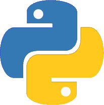

# Hi there, I'm Gideon Ochieng! 

🚀 **Data Scientist | AI Enthusiast | Problem Solver**  
📍 Nairobi, Kenya  

 

---

### 🌟 About Me
Hey! I'm Gideon, a passionate **Data Scientist** with a strong background in **machine learning, AI, and data analysis**. I love turning messy datasets into actionable insights and building models that drive real-world impact. My journey in tech has been fueled by curiosity, coffee ☕, and an insatiable hunger for solving complex problems.

💻 **Tech Explorer** | 📊 **Data Enthusiast** | 🤖 **AI Innovator**  

- 🎓 **Computer Science Graduate** – The Catholic University of Eastern Africa  
- 🎓 **Data Science Bootcamp Graduate** – Moringa School  
- 🏆 **Hackathon Finalist** – Achieved 99.7% accuracy with an optimized image classification model  
- 🎯 Currently exploring **AI for Good**, deploying machine learning models, and contributing to open-source projects  

---

### 💡 What I Do
🔍 **Data Analysis & Visualization** – I turn raw data into compelling stories using Python, SQL, and Tableau.  
🤖 **Machine Learning & AI** – I build predictive models and optimize deep learning pipelines.  
🛠️ **End-to-End Model Deployment** – Taking AI models from Jupyter notebooks to scalable APIs.  
🎬 **Content Creator** – Sharing insights on AI, data science, and tech on X.  

---

### 🔥 My Tech Stack
🖥️ **Languages**:  
   

📚 **Libraries & Frameworks**:  
      

📊 **Data Visualization**:  
   

🚀 **Model Deployment**:  
 

☁️ **Tools & Cloud**:  
   

🛠️ **Web Development**:  
   
 

---

### 🏆 Achievements & Projects
- 🏅 **Optimized CNN Model** – Achieved 99.7% validation accuracy while reducing parameters by 30%.
- 📊 **Movie Data Analysis** – Identified high-grossing film genres for a new movie studio venture.
- ✈️ **Aviation Safety Analysis** – Provided insights to minimize aircraft risks for business expansion.
- 📈 **Stock Market Forecasting** – Built a predictive model for market trend analysis.

---

### 📌 Fun Facts About Me
- 🚀 Passionate about **AI ethics & fairness**.
- 🎮 Love playing FIFA & watching football ⚽.
- 📚 Enjoy reading about **space exploration & deep learning**.
- 🌍 Always open to collaborating on **data-driven projects**.

---

### 🌍 Let's Connect!
📩 **Email**: [gideonochieng@example.com](mailto:gideonochieng@example.com)  
🐦 **X (Twitter)**: [@gideon_ai](https://twitter.com/gideon_ai)  
💼 **LinkedIn**: [Gideon Ochieng](https://linkedin.com/in/gideonochieng)  
📊 **Kaggle**: [GideonOchieng](https://kaggle.com/gideonochieng)  
🎥 **YouTube**: [Gideon AI Insights](https://youtube.com/gideon_ai)  
🚀 **Portfolio**: [gideonochieng.dev](https://gideonochieng.dev)  

---

🚀 **"Data is the new oil, but insights are the real gold."** Let's build something amazing together! 💡✨

<!--
**OchiengGideon/OchiengGideon** is a ✨ _special_ ✨ repository because its `README.md` (this file) appears on your GitHub profile.

Here are some ideas to get you started:

- 🔭 I’m currently working on ...
- 🌱 I’m currently learning ...
- 👯 I’m looking to collaborate on ...
- 🤔 I’m looking for help with ...
- 💬 Ask me about ...
- 📫 How to reach me: ...
- 😄 Pronouns: ...
- ⚡ Fun fact: ...
-->
